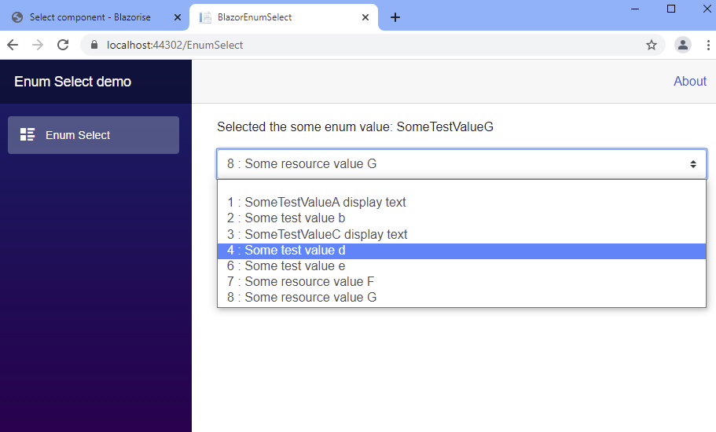

### Enum select sample

Install the package:

```powershell
Install-Package BlazorEnumSelect.ToreAurstadIT
```

This razor class library contains a Blazor control that allows
data binding to a property of type enum (nullable enums are supported).

This sample is built upon the article here:
https://www.meziantou.net/creating-a-inputselect-component-for-enumerations-in-blazor.htm

In addition, this control contains some additional parameters to control the 
rendering output:

### Parameters

|Parameter | Datatype  | Usage (default value) |
--- | --- | ---
|ShowIntValues|bool|Shows the enum value prefixing the text separated by a colon letter :. (default is true)|
|EmptyTextValue|int?|Define the int? value of the enum where we will have empty text (default is null) |
|AdditionalCssClasses|string|List up css classes separated by space that will be added to the select element. E.g. Blazorise uses 'custom-select' as css class for its select element|




### Building this library into a Nuget

Run the following command after bumping Version element value 

From ToreAurstadIT.BlazorEnumSelect : 

```bash
dotnet build  --configuration Release
dotnet pack --configuration Release
```
